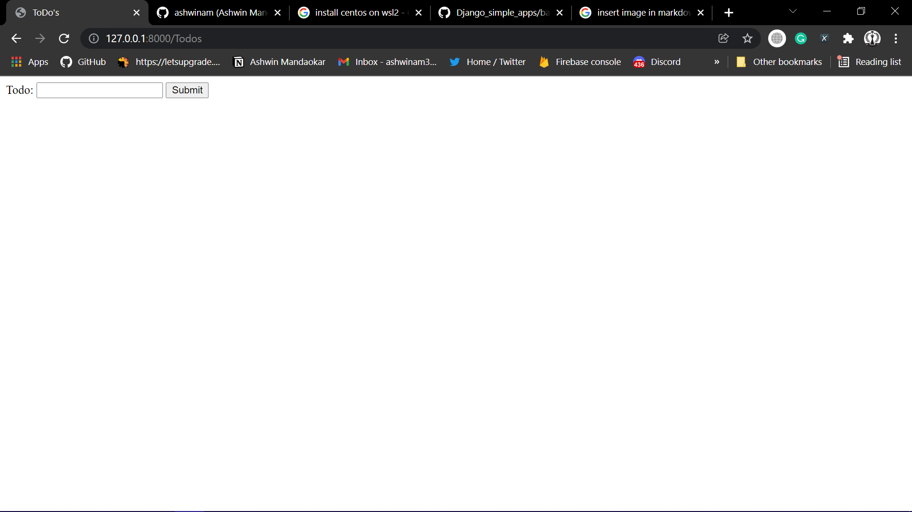
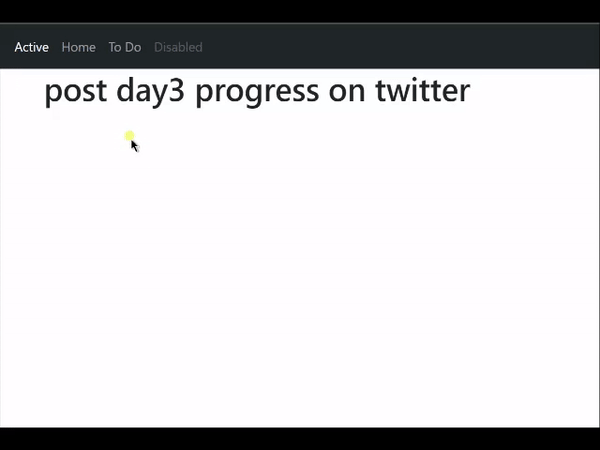

# 100 Days Of Code - Log

### Day 0: December 22, 2021)

**Today's Progress**: Done the Todo App using Python.

**Thoughts**: I am planning to create horizonttal view of the tables but while i changing things i messed up then i am decided to do in vertical way, but over the period of time i know i making progress without obstacles you are not making any progress.

**You can Check It out Here**: [ToDo App](https://github.com/ashwinam/basicToDo-App-using-Python)

### Day 1: December 23, 2021 Thursday

**Today's Progress**: I'Have Done a very easy programs using python(not a language specfic problems).

**Thoughts** Today i am not feeling to do coding because of procrastination, but i force myself to take a step and i achieve my one hour daily Goal.what You need is just a start and evrything is fall in the place "Just Like Richard Branson says Screw it, Let's Do it" 

**Link(s) to work**
1. [Code Snippets](https://gist.github.com/ashwinam/f8b3def926a8a02b679d0cac3fe1b1d4)

### Day 2: December 24, 2021 Friday

**Today's Progress**: Today I'm started the Django(Python framework) Project(todo_django).
#### Task Completed
- created django project
- initialize github repo
- sqlite db setup 

**Thoughts** Today i feel good for starting the project and i wanted to complete till 31st december after that need to start working on blog site 

**Link(s) to work**
[ToDO_Django](https://github.com/ashwinam/django_ToDo)

### Day 3: December 25, 2021 Saturday

**Today's Progress**: continue with django project, what i done is create a navbar using bootstrap, extend the base html to another html file using DTL(django template language) and take a data through todo form and print it on another html file 

#### Task Completed
- create a navbar using bootstrap cdn
- using DTL extends the single HTML file to All html files that way you dont need to copy paste 
- show the form data to new html file

**Thoughts** Today I got stuck while creating views, because the data was not showing, the reason was that I had not set the request method post, so that's why it took me more time to resolve this issue. But if feels Good That we Are progressing before that i directly go and search the google.

